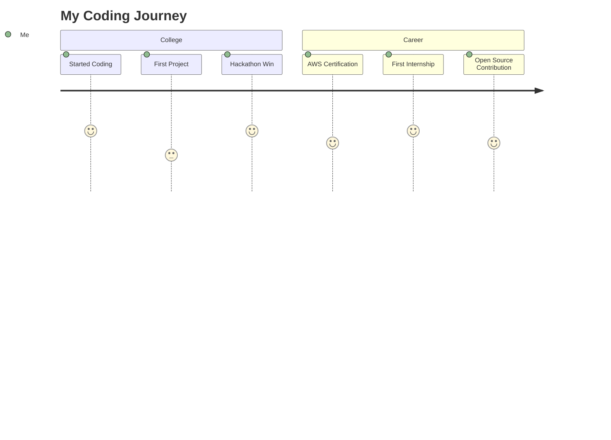
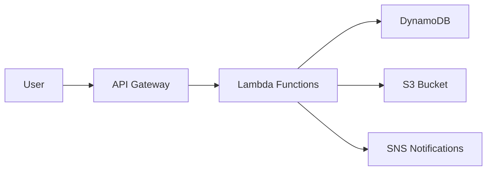

#  Hello, I'm P. Muni Lokitha!

  

  
  
  
  
  
  

## 👨‍💻 About Me

- 🎓 B.Tech Software Engineering Student
- 🚀 Passionate about DevOps, Cloud Engineering, and Frontend Development
- 🎨 UI/UX Design enthusiast
- 🌱 Currently learning advanced AWS services and Kubernetes
- 🔭 Working on cloud-native applications and serverless architectures
- 🎯 Goal: To build innovative cloud-native apps and become a Cloud/DevOps Engineer

📊 My Coding Journey

 

## 🛠️ Tech Stack

  
  
  
  
  
  
  
  
  
  
  
  

🔧 DevOps & Cloud Tools

 

  
  
  
  
  
  
  
  
  
  

## 🏆 GitHub Achievements

  

📈 GitHub Stats

 

  

  

  

  

## 🚀 Featured Projects

  
  
  

📂 Project Highlights

 

### 💼 Job Portal Serverless Webapp
A serverless job platform built with AWS Lambda, API Gateway, DynamoDB, and S3. Enables job posting, applications, and real-time notifications.

### 🎪 Campus Fest Hub
AWS-based event announcement platform for colleges featuring event registration, notifications, and analytics.

### 🗣️ WhisprNote
Voice-based journaling application using AWS Lambda, Comprehend for sentiment analysis, and S3 for storage.

## 🌱 Currently Learning

  
  
  
  
  
  
  
  
  
  
  

## 🎨 Fun Fact

  

When I'm not coding, you'll find me painting and designing - creativity flows from canvas to code!

## 📫 Connect With Me

  
  
  

  

  
  
  

---

  

